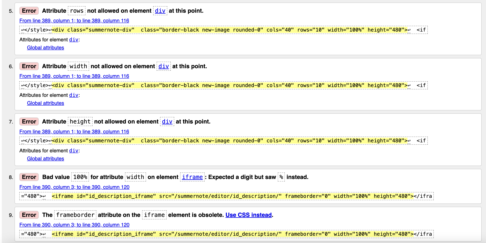
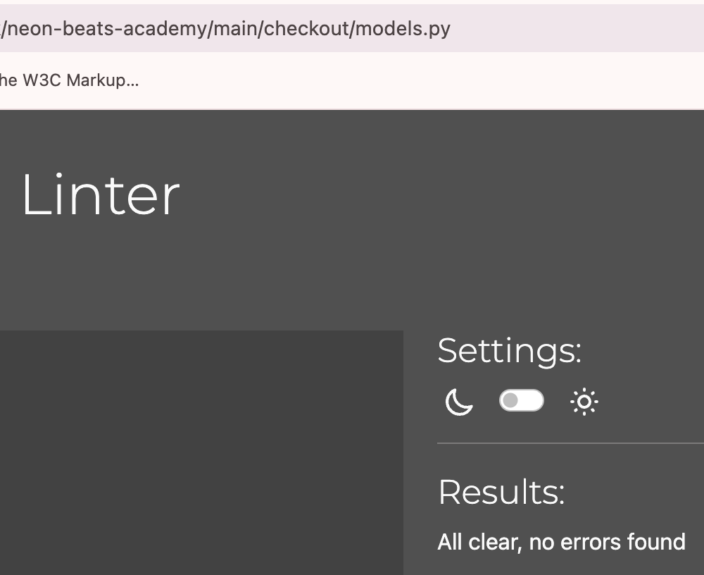

# Testing

> Return back to the [README.md](README.md) file.

## Code Validation

### HTML

I have used the recommended [HTML W3C Validator](https://validator.w3.org) to validate all of my HTML files.

| Directory | File | Screenshot | Notes |
| --- | --- | --- | --- |
| bag | bag.html |  | Passed with no errors |
| checkout | checkout.html |  | Passed with no errors |
| checkout | checkout_success.html |  | Passed with no errors |
| courses | add_course.html |  | My own code passed, but the code rendered by the summernote widget did not. |
|  |  |  | |
|  |  |  | |
|  |  |  | |
| courses | course_detail.html |  | My own code passed, but the code rendered by summernote did not. |
|  |  |  | |
| courses | courses.html |  | Passed with no errors |
| courses | edit_course.html |  | My own code passed, but the code rendered by the summernote widget did not. |
|  |  |  | |
|  |  |  | |
| home | index.html |  | Passed with no errors |
| information | about.html |  | My own code passed, but the code rendered by summernote did not. |
|  |  |  | |
| information | contact_us.html |  | Passed with no errors |
| information | faq.html |  | Passed with no errors |
| newsletter | subscribe.html |  | Passed with no errors |
| profiles | profile.html |  | Passed with no errors |
| templates | 404.html |  | Passed with no errors |
| templates | 500.html |  | Passed with no errors |
| Allauth | signup.html |  | My own code passed, but the code rendered by allauth did not. This is a known bug on the signup page. |
| Allauth | login.html |  | Passed with no errors |
| Allauth | logout.html |  | Passed with no errors |
| Allauth | password_change.html |  | Passed with no errors |

### CSS

I have used the recommended [CSS Jigsaw Validator](https://jigsaw.w3.org/css-validator) to validate all of my CSS files.

| Directory | File | Screenshot | Notes |
| --- | --- | --- | --- |
| checkout | checkout.css |  | Passed with no errors |
| profiles | profile.css |  | Passed with no errors |
| static | base.css |  | Passed with no errors |

### JavaScript

I have used the recommended [JShint Validator](https://jshint.com) to validate all of my JS files.

| Directory | File | Screenshot | Notes |
| --- | --- | --- | --- |
| checkout | stripe_elements.js |  | Passed with one warning due to JSHint not recognizing the stripe function, which is defined by the Stripe JavaScript library. |
| profiles | countryfield.js |  | Passed with no errors |

### Python

I have used the recommended [PEP8 CI Python Linter](https://pep8ci.herokuapp.com) to validate all of my Python files.

| Directory | File | CI URL | Screenshot | Notes |
| --- | --- | --- | --- | --- |
| bag | admin.py | [PEP8 CI](https://pep8ci.herokuapp.com/https://raw.githubusercontent.com/lunartechfreek/neon-beats-academy/main/bag/admin.py) |  | Passed with no errors |
| bag | contexts.py | [PEP8 CI](https://pep8ci.herokuapp.com/https://raw.githubusercontent.com/lunartechfreek/neon-beats-academy/main/bag/contexts.py) |  | Passed with no errors |
| bag | models.py | [PEP8 CI](https://pep8ci.herokuapp.com/https://raw.githubusercontent.com/lunartechfreek/neon-beats-academy/main/bag/models.py) |  | Passed with no errors |
| bag | urls.py | [PEP8 CI](https://pep8ci.herokuapp.com/https://raw.githubusercontent.com/lunartechfreek/neon-beats-academy/main/bag/urls.py) |  | Passed with no errors |
| bag | views.py | [PEP8 CI](https://pep8ci.herokuapp.com/https://raw.githubusercontent.com/lunartechfreek/neon-beats-academy/main/bag/views.py) |  | Passed with no errors |
| checkout | admin.py | [PEP8 CI](https://pep8ci.herokuapp.com/https://raw.githubusercontent.com/lunartechfreek/neon-beats-academy/main/checkout/admin.py) |  | Passed with no errors |
| checkout | forms.py | [PEP8 CI](https://pep8ci.herokuapp.com/https://raw.githubusercontent.com/lunartechfreek/neon-beats-academy/main/checkout/forms.py) |  | Passed with no errors |
| checkout | models.py | [PEP8 CI](https://pep8ci.herokuapp.com/https://raw.githubusercontent.com/lunartechfreek/neon-beats-academy/main/checkout/models.py) |  | Passed with no errors |
| checkout | signals.py | [PEP8 CI](https://pep8ci.herokuapp.com/https://raw.githubusercontent.com/lunartechfreek/neon-beats-academy/main/checkout/signals.py) |  | Passed with no errors |
| checkout | urls.py | [PEP8 CI](https://pep8ci.herokuapp.com/https://raw.githubusercontent.com/lunartechfreek/neon-beats-academy/main/checkout/urls.py) |  | Passed with no errors |
| checkout | views.py | [PEP8 CI](https://pep8ci.herokuapp.com/https://raw.githubusercontent.com/lunartechfreek/neon-beats-academy/main/checkout/views.py) |  | Passed with no errors |
| courses | admin.py | [PEP8 CI](https://pep8ci.herokuapp.com/https://raw.githubusercontent.com/lunartechfreek/neon-beats-academy/main/courses/admin.py) |  | Passed with no errors |
| courses | forms.py | [PEP8 CI](https://pep8ci.herokuapp.com/https://raw.githubusercontent.com/lunartechfreek/neon-beats-academy/main/courses/forms.py) |  | Passed with no errors |
| courses | models.py | [PEP8 CI](https://pep8ci.herokuapp.com/https://raw.githubusercontent.com/lunartechfreek/neon-beats-academy/main/courses/models.py) |  | Passed with no errors |
| courses | urls.py | [PEP8 CI](https://pep8ci.herokuapp.com/https://raw.githubusercontent.com/lunartechfreek/neon-beats-academy/main/courses/urls.py) |  | Passed with no errors |
| courses | views.py | [PEP8 CI](https://pep8ci.herokuapp.com/https://raw.githubusercontent.com/lunartechfreek/neon-beats-academy/main/courses/views.py) |  | Passed with no errors |
| courses | widgets.py | [PEP8 CI](https://pep8ci.herokuapp.com/https://raw.githubusercontent.com/lunartechfreek/neon-beats-academy/main/courses/widgets.py) |  | Passed with no errors |
| home | admin.py | [PEP8 CI](https://pep8ci.herokuapp.com/https://raw.githubusercontent.com/lunartechfreek/neon-beats-academy/main/home/admin.py) |  | Passed with no errors |
| home | models.py | [PEP8 CI](https://pep8ci.herokuapp.com/https://raw.githubusercontent.com/lunartechfreek/neon-beats-academy/main/home/models.py) |  | Passed with no errors |
| home | urls.py | [PEP8 CI](https://pep8ci.herokuapp.com/https://raw.githubusercontent.com/lunartechfreek/neon-beats-academy/main/home/urls.py) |  | Passed with no errors |
| home | views.py | [PEP8 CI](https://pep8ci.herokuapp.com/https://raw.githubusercontent.com/lunartechfreek/neon-beats-academy/main/home/views.py) |  | Passed with no errors |
| information | admin.py | [PEP8 CI](https://pep8ci.herokuapp.com/https://raw.githubusercontent.com/lunartechfreek/neon-beats-academy/main/information/admin.py) |  | Passed with no errors |
| information | forms.py | [PEP8 CI](https://pep8ci.herokuapp.com/https://raw.githubusercontent.com/lunartechfreek/neon-beats-academy/main/information/forms.py) |  | Passed with no errors |
| information | models.py | [PEP8 CI](https://pep8ci.herokuapp.com/https://raw.githubusercontent.com/lunartechfreek/neon-beats-academy/main/information/models.py) |  | Passed with no errors |
| information | urls.py | [PEP8 CI](https://pep8ci.herokuapp.com/https://raw.githubusercontent.com/lunartechfreek/neon-beats-academy/main/information/urls.py) |  | Passed with no errors |
| information | views.py | [PEP8 CI](https://pep8ci.herokuapp.com/https://raw.githubusercontent.com/lunartechfreek/neon-beats-academy/main/information/views.py) |  | Passed with no errors |
|  | manage.py | [PEP8 CI](https://pep8ci.herokuapp.com/https://raw.githubusercontent.com/lunartechfreek/neon-beats-academy/main/manage.py) |  | Passed with no errors |
| neon_beats | settings.py | [PEP8 CI](https://pep8ci.herokuapp.com/https://raw.githubusercontent.com/lunartechfreek/neon-beats-academy/main/neon_beats/settings.py) |  | Passed with no errors |
| neon_beats | urls.py | [PEP8 CI](https://pep8ci.herokuapp.com/https://raw.githubusercontent.com/lunartechfreek/neon-beats-academy/main/neon_beats/urls.py) |  | Passed with no errors |
| neon_beats | views.py | [PEP8 CI](https://pep8ci.herokuapp.com/https://raw.githubusercontent.com/lunartechfreek/neon-beats-academy/main/neon_beats/views.py) |  | Passed with no errors |
| newsletter | admin.py | [PEP8 CI](https://pep8ci.herokuapp.com/https://raw.githubusercontent.com/lunartechfreek/neon-beats-academy/main/newsletter/admin.py) |  | Passed with no errors |
| newsletter | forms.py | [PEP8 CI](https://pep8ci.herokuapp.com/https://raw.githubusercontent.com/lunartechfreek/neon-beats-academy/main/newsletter/forms.py) |  | Passed with no errors |
| newsletter | models.py | [PEP8 CI](https://pep8ci.herokuapp.com/https://raw.githubusercontent.com/lunartechfreek/neon-beats-academy/main/newsletter/models.py) |  | Passed with no errors |
| newsletter | urls.py | [PEP8 CI](https://pep8ci.herokuapp.com/https://raw.githubusercontent.com/lunartechfreek/neon-beats-academy/main/newsletter/urls.py) |  | Passed with no errors |
| newsletter | views.py | [PEP8 CI](https://pep8ci.herokuapp.com/https://raw.githubusercontent.com/lunartechfreek/neon-beats-academy/main/newsletter/views.py) |  | Passed with no errors |
| profiles | admin.py | [PEP8 CI](https://pep8ci.herokuapp.com/https://raw.githubusercontent.com/lunartechfreek/neon-beats-academy/main/profiles/admin.py) |  | Passed with no errors |
| profiles | forms.py | [PEP8 CI](https://pep8ci.herokuapp.com/https://raw.githubusercontent.com/lunartechfreek/neon-beats-academy/main/profiles/forms.py) |  | Passed with no errors |
| profiles | models.py | [PEP8 CI](https://pep8ci.herokuapp.com/https://raw.githubusercontent.com/lunartechfreek/neon-beats-academy/main/profiles/models.py) |  | Passed with no errors |
| profiles | urls.py | [PEP8 CI](https://pep8ci.herokuapp.com/https://raw.githubusercontent.com/lunartechfreek/neon-beats-academy/main/profiles/urls.py) |  | Passed with no errors |
| profiles | views.py | [PEP8 CI](https://pep8ci.herokuapp.com/https://raw.githubusercontent.com/lunartechfreek/neon-beats-academy/main/profiles/views.py) |  | Passed with no errors |

