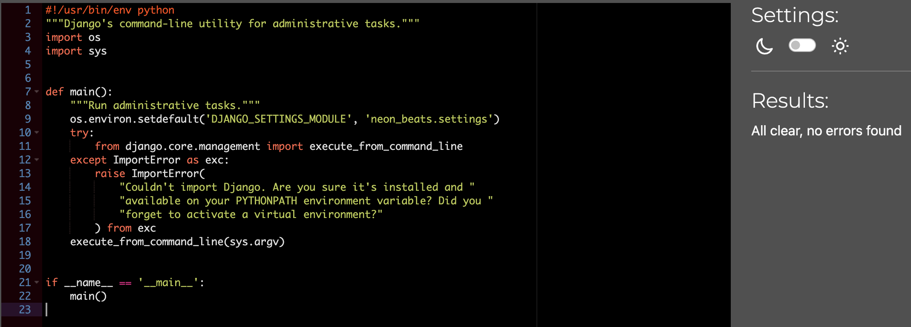
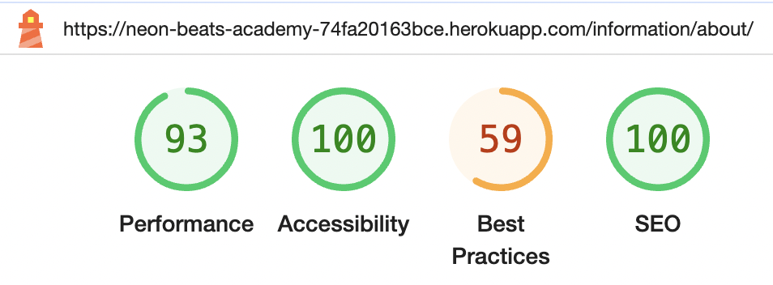

# Testing

> Return back to the [README.md](README.md) file.

## Code Validation

### HTML

I have used the recommended [HTML W3C Validator](https://validator.w3.org) to validate all of my HTML files.

| Directory | File | Screenshot | Notes |
| --- | --- | --- | --- |
| bag | bag.html |  | Passed with no errors |
| checkout | checkout.html |  | Passed with no errors |
| checkout | checkout_success.html |  | Passed with no errors |
| courses | add_course.html |  | My own code passed with no errors, but the code rendered by the summernote widget did not. (See [Bugs](#bugs) section. ) |
|  |  |  | Summernote Errors |
|  |  |  | Summernote Errors |
|  |  |  | Summernote Errors |
| courses | course_detail.html |  | My own code passed with no errors, but the code rendered by summernote did not. (See [Bugs](#bugs) section. ) |
|  |  |  | Summernote Errors |
| courses | courses.html |  | Passed with no errors |
| courses | edit_course.html |  | My own code passed with no errors, but the code rendered by the summernote widget did not. (See [Bugs](#bugs) section. ) |
|  |  |  | Summernote Errors |
|  |  |  | Summernote Errors |
| home | index.html |  | Passed with no errors |
| information | about.html |  | My own code passed with no errors, but the code rendered by summernote did not. (See [Bugs](#bugs) section. ) |
|  |  |  | Summernote Errors |
| information | contact_us.html |  | Passed with no errors |
| information | faq.html |  | Passed with no errors |
| newsletter | subscribe.html |  | Passed with no errors |
| profiles | profile.html |  | Passed with no errors |
| templates | 404.html |  | Passed with no errors |
| templates | 500.html |  | Passed with no errors |
| Allauth | signup.html |  | My own code passed, but the code rendered by allauth did not. This is a known bug on the signup page. (See [Bugs](#bugs) section. ) |
| Allauth | login.html |  | Passed with no errors |
| Allauth | logout.html |  | Passed with no errors |
| Allauth | password_change.html |  | Passed with no errors. Had one info warning regarding trailing slash on an input. This input was not my own code and was rendered by Allauth. (See [Bugs](#bugs) section.) |

### CSS

I have used the recommended [CSS Jigsaw Validator](https://jigsaw.w3.org/css-validator) to validate all of my CSS files.

| Directory | File | Screenshot | Notes |
| --- | --- | --- | --- |
| checkout | checkout.css |  | Passed with no errors |
| profiles | profile.css |  | Passed with no errors |
| static | base.css |  | Passed with no errors |

### JavaScript

I have used the recommended [JShint Validator](https://jshint.com) to validate all of my JS files.

| Directory | File | Screenshot | Notes |
| --- | --- | --- | --- |
| checkout | stripe_elements.js |  | Passed with one warning due to JSHint not recognizing the stripe function, which is defined by the Stripe JavaScript library. |
| profiles | countryfield.js |  | Passed with no errors |

### Python

I have used the recommended [PEP8 CI Python Linter](https://pep8ci.herokuapp.com) to validate all of my Python files.

| Directory | File | CI URL | Screenshot | Notes |
| --- | --- | --- | --- | --- |
| bag | admin.py | [PEP8 CI](https://pep8ci.herokuapp.com/https://raw.githubusercontent.com/lunartechfreek/neon-beats-academy/main/bag/admin.py) |  | Passed with no errors |
| bag | contexts.py | [PEP8 CI](https://pep8ci.herokuapp.com/https://raw.githubusercontent.com/lunartechfreek/neon-beats-academy/main/bag/contexts.py) |  | Passed with no errors |
| bag | models.py | [PEP8 CI](https://pep8ci.herokuapp.com/https://raw.githubusercontent.com/lunartechfreek/neon-beats-academy/main/bag/models.py) |  | Passed with no errors |
| bag | urls.py | [PEP8 CI](https://pep8ci.herokuapp.com/https://raw.githubusercontent.com/lunartechfreek/neon-beats-academy/main/bag/urls.py) |  | Passed with no errors |
| bag | views.py | [PEP8 CI](https://pep8ci.herokuapp.com/https://raw.githubusercontent.com/lunartechfreek/neon-beats-academy/main/bag/views.py) |  | Passed with no errors |
| checkout | admin.py | [PEP8 CI](https://pep8ci.herokuapp.com/https://raw.githubusercontent.com/lunartechfreek/neon-beats-academy/main/checkout/admin.py) |  | Passed with no errors |
| checkout | forms.py | [PEP8 CI](https://pep8ci.herokuapp.com/https://raw.githubusercontent.com/lunartechfreek/neon-beats-academy/main/checkout/forms.py) |  | Passed with no errors |
| checkout | models.py | [PEP8 CI](https://pep8ci.herokuapp.com/https://raw.githubusercontent.com/lunartechfreek/neon-beats-academy/main/checkout/models.py) |  | Passed with no errors |
| checkout | signals.py | [PEP8 CI](https://pep8ci.herokuapp.com/https://raw.githubusercontent.com/lunartechfreek/neon-beats-academy/main/checkout/signals.py) |  | Passed with no errors |
| checkout | urls.py | [PEP8 CI](https://pep8ci.herokuapp.com/https://raw.githubusercontent.com/lunartechfreek/neon-beats-academy/main/checkout/urls.py) |  | Passed with no errors |
| checkout | views.py | [PEP8 CI](https://pep8ci.herokuapp.com/https://raw.githubusercontent.com/lunartechfreek/neon-beats-academy/main/checkout/views.py) |  | Passed with no errors |
| courses | admin.py | [PEP8 CI](https://pep8ci.herokuapp.com/https://raw.githubusercontent.com/lunartechfreek/neon-beats-academy/main/courses/admin.py) |  | Passed with no errors |
| courses | forms.py | [PEP8 CI](https://pep8ci.herokuapp.com/https://raw.githubusercontent.com/lunartechfreek/neon-beats-academy/main/courses/forms.py) |  | Passed with no errors |
| courses | models.py | [PEP8 CI](https://pep8ci.herokuapp.com/https://raw.githubusercontent.com/lunartechfreek/neon-beats-academy/main/courses/models.py) |  | Passed with no errors |
| courses | urls.py | [PEP8 CI](https://pep8ci.herokuapp.com/https://raw.githubusercontent.com/lunartechfreek/neon-beats-academy/main/courses/urls.py) |  | Passed with no errors |
| courses | views.py | [PEP8 CI](https://pep8ci.herokuapp.com/https://raw.githubusercontent.com/lunartechfreek/neon-beats-academy/main/courses/views.py) |  | Passed with no errors |
| courses | widgets.py | [PEP8 CI](https://pep8ci.herokuapp.com/https://raw.githubusercontent.com/lunartechfreek/neon-beats-academy/main/courses/widgets.py) |  | Passed with no errors |
| home | admin.py | [PEP8 CI](https://pep8ci.herokuapp.com/https://raw.githubusercontent.com/lunartechfreek/neon-beats-academy/main/home/admin.py) |  | Passed with no errors |
| home | models.py | [PEP8 CI](https://pep8ci.herokuapp.com/https://raw.githubusercontent.com/lunartechfreek/neon-beats-academy/main/home/models.py) |  | Passed with no errors |
| home | urls.py | [PEP8 CI](https://pep8ci.herokuapp.com/https://raw.githubusercontent.com/lunartechfreek/neon-beats-academy/main/home/urls.py) |  | Passed with no errors |
| home | views.py | [PEP8 CI](https://pep8ci.herokuapp.com/https://raw.githubusercontent.com/lunartechfreek/neon-beats-academy/main/home/views.py) |  | Passed with no errors |
| information | admin.py | [PEP8 CI](https://pep8ci.herokuapp.com/https://raw.githubusercontent.com/lunartechfreek/neon-beats-academy/main/information/admin.py) |  | Passed with no errors |
| information | forms.py | [PEP8 CI](https://pep8ci.herokuapp.com/https://raw.githubusercontent.com/lunartechfreek/neon-beats-academy/main/information/forms.py) |  | Passed with no errors |
| information | models.py | [PEP8 CI](https://pep8ci.herokuapp.com/https://raw.githubusercontent.com/lunartechfreek/neon-beats-academy/main/information/models.py) |  | Passed with no errors |
| information | urls.py | [PEP8 CI](https://pep8ci.herokuapp.com/https://raw.githubusercontent.com/lunartechfreek/neon-beats-academy/main/information/urls.py) |  | Passed with no errors |
| information | views.py | [PEP8 CI](https://pep8ci.herokuapp.com/https://raw.githubusercontent.com/lunartechfreek/neon-beats-academy/main/information/views.py) |  | Passed with no errors |
|  | manage.py | [PEP8 CI](https://pep8ci.herokuapp.com/https://raw.githubusercontent.com/lunartechfreek/neon-beats-academy/main/manage.py) |  | Passed with no errors |
| neon_beats | settings.py | [PEP8 CI](https://pep8ci.herokuapp.com/https://raw.githubusercontent.com/lunartechfreek/neon-beats-academy/main/neon_beats/settings.py) |  | Passed with no errors |
| neon_beats | urls.py | [PEP8 CI](https://pep8ci.herokuapp.com/https://raw.githubusercontent.com/lunartechfreek/neon-beats-academy/main/neon_beats/urls.py) |  | Passed with no errors |
| neon_beats | views.py | [PEP8 CI](https://pep8ci.herokuapp.com/https://raw.githubusercontent.com/lunartechfreek/neon-beats-academy/main/neon_beats/views.py) |  | Passed with no errors |
| newsletter | admin.py | [PEP8 CI](https://pep8ci.herokuapp.com/https://raw.githubusercontent.com/lunartechfreek/neon-beats-academy/main/newsletter/admin.py) |  | Passed with no errors |
| newsletter | forms.py | [PEP8 CI](https://pep8ci.herokuapp.com/https://raw.githubusercontent.com/lunartechfreek/neon-beats-academy/main/newsletter/forms.py) |  | Passed with no errors |
| newsletter | models.py | [PEP8 CI](https://pep8ci.herokuapp.com/https://raw.githubusercontent.com/lunartechfreek/neon-beats-academy/main/newsletter/models.py) |  | Passed with no errors |
| newsletter | urls.py | [PEP8 CI](https://pep8ci.herokuapp.com/https://raw.githubusercontent.com/lunartechfreek/neon-beats-academy/main/newsletter/urls.py) |  | Passed with no errors |
| newsletter | views.py | [PEP8 CI](https://pep8ci.herokuapp.com/https://raw.githubusercontent.com/lunartechfreek/neon-beats-academy/main/newsletter/views.py) |  | Passed with no errors |
| profiles | admin.py | [PEP8 CI](https://pep8ci.herokuapp.com/https://raw.githubusercontent.com/lunartechfreek/neon-beats-academy/main/profiles/admin.py) |  | Passed with no errors |
| profiles | forms.py | [PEP8 CI](https://pep8ci.herokuapp.com/https://raw.githubusercontent.com/lunartechfreek/neon-beats-academy/main/profiles/forms.py) |  | Passed with no errors |
| profiles | models.py | [PEP8 CI](https://pep8ci.herokuapp.com/https://raw.githubusercontent.com/lunartechfreek/neon-beats-academy/main/profiles/models.py) |  | Passed with no errors |
| profiles | urls.py | [PEP8 CI](https://pep8ci.herokuapp.com/https://raw.githubusercontent.com/lunartechfreek/neon-beats-academy/main/profiles/urls.py) |  | Passed with no errors |
| profiles | views.py | [PEP8 CI](https://pep8ci.herokuapp.com/https://raw.githubusercontent.com/lunartechfreek/neon-beats-academy/main/profiles/views.py) |  | Passed with no errors |

## Browser Compatibility

I've tested my deployed project on multiple browsers to check for compatibility issues.

| Browser | Home | About | Contact | Courses | Notes |
| --- | --- | --- | --- | --- | --- |
| Chrome |  |  |  |  | Works as expected |
| Firefox |  |  |  |  | Works as expected |
| Edge |  |  |  |  | Works as expected |
| Safari |  |  |  |  | Works as expected |
| Opera |  |  |  |  | Works as expected |

## Responsiveness

I've tested my deployed project on multiple devices to check for responsiveness issues.

| Device | Home | About | Contact | Courses | Notes | 
| --- | --- | --- | --- | --- | --- | 
| MacBook Pro (Real Device Test) |  |  |  |  | Works as expected |
| Desktop XL |  |  |  |  |  Works as expected |
| iPhone 15 Pro Max (Real Device Test) |  |  |  |  | Works as expected |
| iPhone SE |  |  |  |  | Works as expected | 
| iPhone 16 |  |  |  |  | Works as expected |    
| iPad Mini |  |  |  |  | Works as expected |  
| iPad Air |  |  |  |  | Works as expected |  
| Galaxy Tab |  |  |  |  | Works as expected |
| Galaxy S24 Ultra |  |  |  |  | Works as expected | 

## Lighthouse Audit

I've tested my deployed project using the Lighthouse Audit tool to check for any major issues.

| Page | Mobile | Desktop | Notes |
| --- | --- | --- | --- |
| Home |  |  |  |
| Courses |  |  |  |
| Course detail |  |  |  |
| Add course |  |  |  |
| Edit course |  |  |  |
| Bag |  |  |  |
| Checkout |  |  |  |
| Checkout Success |  |  |  |
| Profile |  |  |  |
| About |  |  |  |
| Contact |  |  |  |
| Faq |  |  |  |
| Newsletter |  |  |  |
| Signup |  |  |  |
| Login |  |  |  |
| Logout |  |  |  |
| Change password |  |  |  |

## Defensive Programming

Defensive programming was manually tested with the below user acceptance testing:

| Page | User Action | Expected Result | Screenshot | Pass/Fail |
| --- | --- | --- | --- | --- |
| Bag | | | | |
| | Add duplicate item to bag | Unable to add |  | Pass |
| Logged In As Superuser | | | | |
| | Delete course on detail page | Delete modal appears to check I am sure |  | Pass |
| | Delete course on courses page | Delete modal appears to check I am sure |  | Pass |
| | Click account button | Superuser options appear |  | Pass |
| | Head to course detail page | Edit/delete buttons present |  | Pass |
| | Head to courses page | Edit/delete buttons present |  | Pass |
| | Click product management | Add course page access |  | Pass |
| | Click edit course button | Edit course page access |  | Pass |
| Logged In | | | | |
| | Click account button | Logged in options appear |  | Pass |
| | Head to courses page | Edit/delete buttons not present |  | Pass |
| | Head to course detail page | Edit/delete buttons not present |  | Pass |
| | Attepmpt to access add course via url | Not authorised message apears |  | Pass |
| | Attempt to access edit course via url | Not authorised message apears |  | Pass |
| Account | | | | |
| | Click account button | Logged out options appear |  | Pass |
| | Try to login without verifying email | Verify page appears |  | Pass |
| | Don't provide signup email | Error message appears |  | Pass |
| | Sign in with email that already has an account | Warning email sent to email |  | Pass |
| | Enter invalid/blank password | Error message appears |  | Pass |
| | Input different passwords | Error message appears |  | Pass |
| | Input password similar to username (or the same) | Error message appears |  | Pass |
| Add | | | | |
| | Enter invalid/blank name | Error message appears |  | Pass |
| | Enter invalid/blank difficulty | Error message appears |  | Pass |
| | Enter invalid/blank price | Error message appears |  | Pass |
| | Enter invalid/blank letter | Error message appears |  | Pass |
| | Enter invalid/blank description | Error message appears |  | Pass |
| Message | | | | |
| | Try to add invalid course | Error message appears |  | Pass |
| | Remove course from bag | Success message appears |  | Pass |
| | Add item to bag | Success message appears and item visibly in bag |  | Pass |
| | Update course details | Success message appears |  | Pass |
| | Edit a page | Alert message appears to inform you that you are editing |  | Pass |
| | Delete a course | Success message appears |  | Pass |
| | Add a course | Success message appears |  | Pass |
| | Place an order | Success message appears |  | Pass |
| Checkout | | | | |
| | Click checkout | Overlay appears to show my order is being processed |  | Pass |
| | Place an order | Confirmation page appears |  | Pass |
| | Enter expiration date in the past | Error message appears |  | Pass |
| | Enter invalid card number | Error message appears |  | Pass |
| | Enter blank card number | Error message appears |  | Pass |
| | Enter invalid/blank name | Error message appears |  | Pass |
| | Enter invalid/blank email | Enter invalid/blank |  | Pass |
| | Enter invalid/blank country | Error message appears |  | Pass |
| | Enter invalid/blank town | Error message appears |  | Pass |
| | Enter invalid/blank address | Error message appears |  | Pass |
| | Enter invalid/blank postcode | Error message appears |  | Pass |
| | Enter invalid/blank phone number | Error message appears |  | Pass |
| Newsletter | | | | |
| | Enter invalid email | Error message appears |  | Pass |
| | Enter blank email | Error message appears |  | Pass |
| | Enter email address that is already subscribed | Error message appears |  | Pass |
| | Click subscribe button | Success message appears |  | Pass |
| Contact | | | | |
| | Click send message | Success message appears |  | Pass |
| | Enter invalid/blank message | Error message appears |  | Pass |
| | Enter invalid/blank email | Error message appears |  | Pass |
| | Enter invalid/blank name | Error message appears |  | Pass |
| Profile | | | | |
| | Click update profiel button | Success message appears |  | Pass |

## User Story Testing

### Site User

| User Story | Criteria | Screenshot |
| --- | --- | --- |
| As a site user I can easily view products so that I can choose which ones to buy | | |
| | A clear link to all products will be featured on the home page |  |
| | A link to courses will be featured in the nav bar |  |
| As a site user I can see further details of a product so that I can decide if it is the right product for me | | |
| | When the user clicks on a product they will be directed to a product details page showing further details of the product |  |
| As a site user I can leave comments on a product so that I can ask the site owner a question or tell others what I thought of it | | |
| | Feature a comment section on the product detail page for logged in users |  |
| As a site user I can find information about the site so that I can understand what services the site offers | | |
| | Have an about page |  |
| | Have easily accessible information about the site displayed |  |
| As a site user I would like to contact the site owner so that they can answer any queries I have | | |
| | Contact us page created |  |
| | Form present to directly contact the site owner |  |
| As a site user I can add items to my basket so that they are saved while I continue shopping | | |
| | Have a basket available for users |  |
| | Have a button for adding the product to the basket on the product detail page |  |
| | Have a page for the basket |  |
| | Have a remove button to remove item from the basket |  |
| | User can clearly see the total before checkout |  |
| As a site user I can create an account and login so that I can have a personal account and order items | | |
| | For logged out users, create account and login links featured in the account drop-down of the navigation bar |  |
| | For logged in users, a logout link featured in the account drop-down of the navigation bar |  |
| As a site user I can securely enter my credit card details so that I can securely purchase a product | | |
| | Use Stripe for secure checkout |  |
| | Have a checkout page |  |
| As a site user I can view my order confirmation so I can make sure that I have not made any mistakes | | |
| | Order confirmation page displayed after order is processed |  |
| As a site user I would like to receive an order confirmation email of what I’ve ordered so that I can have a record of the order | | |
| | Users receive an email confirming their order when it has been processed |  |
| As a site user I can receive email confirmation after registering so that I can know my account was successfully created | | |
| | Email confirmation sent after account is created with verification link |  |
| As a site user I can search for products throughout the site so that I can find a specific product easily | | |
| | Have a search bar featured on every page |  |
| | Have a page that shows returned search results |  |
| As a site user I can view specific tiers of courses so that I can easily find courses suitable to my skill level | | |
| | Courses sorted into different tiers |  |
| | Course tiers easily accessible via navigation bar dropdown menu |  |
| | Courses split into tiers on all courses page |  |
| As a site user I can read frequently asked questions from other users so that I can find potential answers to my questions with ease | | |
| | FAQ section available for all users |  |
| As a site user I can easily navigate back to the main site if an error message appears so that I can continue shopping | | |
| | Custom 404 error page |  |
| | Custom 500 error page |  |
| As a site user I can subscribe to a newsletter so that I can stay up to date with new courses | | |
| | Newsletter page featured |  |
| | Easy subscribe method |  |
| | Information about the benefits of signing up to a newsletter |  |

### Returning Site User

| User Story | Criteria | Sreenshot |
| --- | --- | --- |
| As a returning site user I can change password so that I can keep my account up to date | | |
| | For logged in users a change password link will be available from the account dropdown |  |
| As a site user when logged I can have a user profile so that I can change my details | | | | | |
| | Form for logged in users to add/change their details |  |
| As a site user when logged in I can view my order history so that I can see what I have ordered | | | | | |
| | Order history section available for logged in users |  |

### Site Owner

| User Story | Criteria | Screenshot |
| --- | --- | --- |
| As a site owner I can add products to the site so that I can give my customers access to new products | | |
| | Have an add product form only available to superusers |  |
| | Enable superusers to upload an image of the product |  |
| As a site owner I can edit a product so that I can keep the details up to date or adjust the price | | |
| | When logged in, a superuser can edit any details of a product using an edit product form that is only accessible by superusers |  |
| | Have an edit product button on the product detail page that is only visible to site owners |  |
| As a site owner I can delete a product so that I can remove items that are no longer available | | |
| | Have a delete button on the product detail page that is only visible to superusers |  |
| | Have a warning box to make sure the superuser definitely wants to delete the product |  |
| | Make deleting a product only available to superusers |  |
| As a site owner I can log in to the admin panel so that I can view orders | | |
| | Admin panel featured |  |
| | Orders section featured in the admin panel |  |
| As a site owner I can log in to the admin panel so that I can check messages from site users | | |
| | Admin panel featured |  |
| | Contact section featured in admin panel |  |
| As a site owner I can change the about text so that I can keep users updated with any relevant information | | |
| | The site owner can update the about text from the admin panel |  |
| As a site owner I can manage products in the admin panel so that I have full control of them in one place | | |
| | Superusers able to add products in the admin panel |  |
| | Superusers able to edit products in the admin panel |  |
| | Superusers able to delete products in the admin panel |  |

